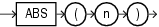

# ABS

Status: Done
Created Date: 25/09/2024 → 27/09/2024
In MySQL: Yes
In PostgreSQL: Yes
Link: https://docs.oracle.com/en/database/oracle/oracle-database/19/sqlrf/ABS.html#GUID-D8D3489A-44EA-4FEC-A6F0-B5E312FFC231
Type: SR - Numeric

The `ABS()` function in SQL returns the **absolute value** of a numeric expression, meaning it converts negative numbers to positive numbers. 

**Syntax :** 



**Examples :**


Oracle supports **implicit data conversion**, meaning it can automatically convert data types in certain contexts. As a result, `ABS('22.5')` works, but `ABS('22.5f')` results in an error.


### **Advanced examples** of using `ABS()` in Oracle SQL

1. **Finding the Maximum Deviation from an Average**

Query is about **finding the deviation from an average** unit price across different product categories.

- **`av.product_dim`**: Holds information about products, including category IDs and names.
- **`av.sales_fact`**: Stores sales data, like total sales amounts and the number of units sold for each category.

```sql
WITH cte_cat_prices AS (
    -- Calculate unit prices per category in one step
    SELECT 
        pr.CATEGORY_ID, 
        pr.CATEGORY_NAME, 
        ROUND(SUM(sf.SALES) / SUM(sf.UNITS), 2) AS UNIT_PRICE
    FROM 
        av.product_dim pr
    JOIN 
        av.sales_fact sf ON pr.CATEGORY_ID = sf.CATEGORY_ID
    GROUP BY 
        pr.CATEGORY_ID, 
        pr.CATEGORY_NAME
),
-- Calculate the overall average unit price only once
avg_price AS (
    SELECT AVG(UNIT_PRICE) AS AVG_UNIT_PRICE FROM cte_cat_prices
)
SELECT 
    ccp.CATEGORY_ID, 
    ccp.CATEGORY_NAME, 
    ccp.UNIT_PRICE, 
    ap.AVG_UNIT_PRICE, 
    ABS(ccp.UNIT_PRICE - ap.AVG_UNIT_PRICE) AS dev_from_avgprice
FROM 
    cte_cat_prices ccp
CROSS JOIN 
    avg_price ap
ORDER BY 
    ccp.UNIT_PRICE;
```

### 2. **Calculating the Distance Between Two Points in a Cartesian Plane**

The formula for the distance between two points is `√((x2 - x1)² + (y2 - y1)²)`

```sql
SELECT point_id, 
       SQRT(POWER(ABS(x2 - x1), 2) + POWER(ABS(y2 - y1), 2)) AS distance
FROM points;
```

### 3. Ranking by Closest Value

You can rank records based on how close a value is to a target number using `ABS()` in combination with the `ROW_NUMBER()` window function.

```sql
WITH cte_cat_prices AS (
    -- Calculate unit prices per category in one step
    SELECT 
        pr.CATEGORY_ID, 
        pr.CATEGORY_NAME, 
        ROUND(SUM(sf.SALES) / SUM(sf.UNITS), 2) AS UNIT_PRICE
    FROM 
        av.product_dim pr
    JOIN 
        av.sales_fact sf ON pr.CATEGORY_ID = sf.CATEGORY_ID
    GROUP BY 
        pr.CATEGORY_ID, 
        pr.CATEGORY_NAME
),
ranked_products AS (
	SELECT CATEGORY_ID, CATEGORY_NAME,UNIT_PRICE,
    	ROW_NUMBER() OVER (ORDER BY ABS(UNIT_PRICE - 250)) AS rank_closest_to_250
    FROM cte_cat_prices
)
    SELECT CATEGORY_NAME, UNIT_PRICE, rank_closest_to_250
	FROM ranked_products
	WHERE rank_closest_to_250 <= 3;
```

### 4.Handling Outliers in Time Series Data

`ABS()` to detect outliers in time series data, such as **large deviations** between consecutive records (e.g., sudden jumps in temperature or stock prices).

```sql
WITH CTE_ORDER_TOTALS AS
(
    SELECT 
        ORD.ORDER_ID,
        ORD.ORDER_DATETIME,
        SUM(ORI.UNIT_PRICE) AS TOTAL_PRICE
    FROM 
        CO.ORDERS ORD
    JOIN 
        CO.ORDER_ITEMS ORI ON ORD.ORDER_ID = ORI.ORDER_ID
    -- WHERE ORD.ORDER_ID BETWEEN 791 AND 800
    GROUP BY 
        ORD.ORDER_ID, 
        ORD.ORDER_DATETIME
),
CTE_WITH_DEVIATION AS
(
    SELECT 
        t1.ORDER_DATETIME, 
        t1.TOTAL_PRICE, 
        -- LAG(t1.TOTAL_PRICE, 1, 0) OVER (ORDER BY t1.ORDER_DATETIME) AS PREV_TOTAL_PRICE,
        ABS(t1.TOTAL_PRICE - LAG(t1.TOTAL_PRICE, 1, 0) OVER (ORDER BY t1.ORDER_DATETIME)) AS PRICE_DEVIATION
    FROM 
        CTE_ORDER_TOTALS t1
)
SELECT * 
FROM 
    CTE_WITH_DEVIATION
WHERE 
    PRICE_DEVIATION > 100;

```